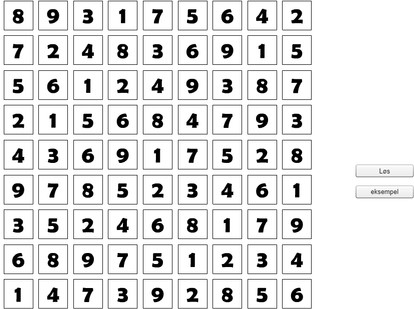

# Sudoku Solver

Solves simple sudoku boards.
Made in 2013 and written in norwegian.

## Screencapture

## Getting Started

Open this [link](https://rawgit.com/gimse/SudokuSolver/master/run_game.html). You can also download the repository and open run_game.html in you browser.

### Prerequisites

Flash Professional too edit.

## Authors

* **Håkon Gimse** - *Initial work* - [Gimse](https://github.com/gimse)

